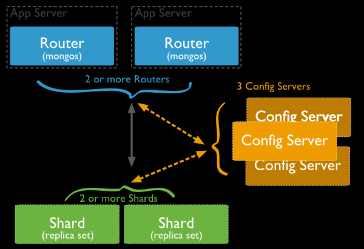

# 原理与手工部署



## 分片集群组成部分

### Shard 分片服务器

存储实际的数据块

### Config Server 配置服务器

存储了整个 分片群集的配置信息 (从MongoDB 3.4开始，必须将配置服务器部署为副本集（CSRS）)

### Query Routers 路由服务器

接受Client 端请求

## 手工部署

- Router Server * 1  
- Config Server * 3  (至少拥有两个副本 不然服务启动)
- Shard Server * 3   


> 提示：部署多个mongos路由器支持高可用性和可伸缩性。常见的模式是mongos在每个应用程序服务器上放置一个，可以减少应用程序和路由器之间的网络延迟。
也可以将mongos路由器放在专用主机上，通过用于大型规模部署。因为它将客户端应用程序服务器的数量与mongos实例数量分离。这样可以更好地控制mongod实例所服务的连接数。
注意：mongos路由器部署的数量没有限制。但是，由于mongos路由器经常与Config Server通信，因此在增加路由器数量时会密切监视配置服务器性能。如果发现性能下降，那么可以适当限制mongos路由器部署的数量。

我们使用docker进行部署 `mongo:latest`   

网络我们使用 `network_mode: bridge`

### Config Server 
创建 加密key

`openssl rand -base64 100 > /etc/mongo/mongo.key`

`chmod 600 /etc/mongo/mongo.key`

mongodb_config_server.conf
``` 
systemLog:
  destination: file
  logAppend: true
  path: /var/log/mongodb/config.log

storage:
  dbPath: /var/lib/mongodb/config
  journal:
    enabled: true
  wiredTiger:
    engineConfig:
      directoryForIndexes: true

processManagement:
  # fork: true #后台运行
  # pidFilePath: /var/run/mongodb/config.pid
  timeZoneInfo: /usr/share/zoneinfo

net:
  port: 37017
  bindIp: 0.0.0.0
  maxIncomingConnections: 5000 设定最大同时连接数，默认为2000

security:
  keyFile: /etc/mongo/mongo.key
  authorization: enabled

replication:
  replSetName: configs

sharding:    #配置服务
  clusterRole: configsvr 
```

docker-compose: 

``` 
version: '3.1'

services:
  mongo_config_server:
    network_mode: bridge
    image: mongo:latest
    restart: always
    ports:
      - 37017:37017
    volumes:
      - ./mongo_config_server_data:/data/mongodb
      - ./mongo_config_server_log:/data/logs
      - /usr/share/zoneinfo:/usr/share/zoneinfo
      - ./config/mongodb_config_server.conf:/etc/mongo/mongodb_config_server.conf
      - ./config/security.key:/etc/mongo/mongo.key
      - ./run.sh:/data/run.sh
    command:
      bash /data/run.sh

```

*初始化配置*
进入容器中，创建的三个配置服务中随便一个

``` 
mongo --port 37017

config = { _id: "configs", members: [
    {_id: 0, host: "192.168.88.39:37017"},
    {_id: 1, host: "192.168.88.40:37017"},
    {_id: 2, host: "192.168.88.41:37017"}]
}
```

*初始化副本集*

``` 
rs.initiate(config)  #初始化集群

rs.status()		#查看集群状态
```

### Shard Server 1
/etc/mongo/shard1.conf
``` 
storage:
  dbPath: /var/lib/mongodb
  journal:
    enabled: true

processManagement:
  timeZoneInfo: /usr/share/zoneinfo

net:
  port: 37018
  bindIp: 0.0.0.0
  maxIncomingConnections: 5000

security:
  keyFile: /etc/mongo/mongo.key
  authorization: enabled

replication:
  replSetName: shard1

sharding:
  clusterRole: shardsvr
```

*初始化配置*
``` 
mongo --port 37018

use admin
rs.initiate(
    {
        _id : "shard1",
        members: [
            { _id : 0, host : "192.168.88.39:37018"}
        ]
    }
)

```

### Router Server
config
```
processManagement:
  timeZoneInfo: /usr/share/zoneinfo

net:
  port: 37019
  bindIp: 0.0.0.0
  maxIncomingConnections: 5000

security:
  keyFile: /etc/mongo/mongo.key


sharding:
  configDB: configs/192.168.88.39:37017,192.168.88.40:37017,192.168.88.41:37017
```

*初始化配置*
进入容器中，创建的三个配置服务中随便一个
``` 
mongo --port 37019

创建用户:
mongos> use admin				#进入admin数据库
mongos> db.createUser({"user":"root","pwd":"root","roles":["root"]})
mongos> db.auth("root", "root")		#验证创建结果

开启分片:
# sh.addShard("shard1/172.24.8.71:20002,172.24.8.72:20002,172.24.8.73:20002")
mongos> use admin
sh.addShard("shard1/192.168.88.39:37018")
sh.addShard("shard2/192.168.88.40:37018")
sh.addShard("shard3/192.168.88.41:37018")
mongos> sh.status()		#查看分片集群状态
--- Sharding Status --- 
  sharding version: {
        "_id" : 1,
        "minCompatibleVersion" : 5,
        "currentVersion" : 6,
        "clusterId" : ObjectId("619347e2c401279726e1ad33")
  }
  shards:
        {  "_id" : "shard1",  "host" : "shard1/192.168.88.39:37018",  "state" : 1,  "topologyTime" : Timestamp(1637046605, 1) }
        {  "_id" : "shard2",  "host" : "shard2/192.168.88.40:37018",  "state" : 1,  "topologyTime" : Timestamp(1637046612, 3) }
        {  "_id" : "shard3",  "host" : "shard3/192.168.88.41:37018",  "state" : 1,  "topologyTime" : Timestamp(1637046617, 2) }
  most recently active mongoses:
        "5.0.3" : 1
  autosplit:
        Currently enabled: yes
  balancer:
        Currently enabled: yes
        Currently running: no
        Failed balancer rounds in last 5 attempts: 0
        Migration results for the last 24 hours: 
                No recent migrations
  databases:
        {  "_id" : "config",  "primary" : "config",  "partitioned" : true }
        
    
设置分片chunk大小
mongos> use config
mongos> db.settings.save({"_id":"chunksize","value":1})		#设置分片大小为1M便于测试
```

*模拟数据写入*
``` 
 mongos> use mydb				#创建用于模拟的数据库
 mongos> for(i=1;i<=50000;i++){db.user.insert({"id":i,"name":"jack"+i})}
 #模拟写入5W条数据到user集合
 WriteResult({ "nInserted" : 1 })		#输出
```
*启用数据库分片*
``` 
mongos> sh.enableSharding("mydb")
```
*创建索引*
``` 
mongos> db.user.createIndex({"id": 1})
```

*启用表分片*
``` 
mongos> sh.shardCollection("mydb.user",{"id": 1})
```

*查看分片情况*
``` 
mongos> sh.status()
```

### 参考
- https://docs.mongodb.com/v5.0/sharding/
- https://docs.mongodb.com/v5.0/tutorial/deploy-shard-cluster/
- https://www.cnblogs.com/itzgr/p/11022248.html#_label1_3

